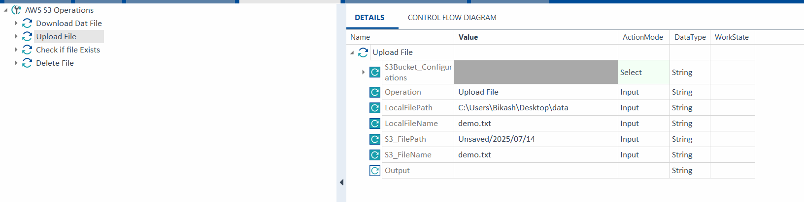

# TOSCA-CSharp-XModules
#
**Author:** Bikash Dehury  
**GitHub:** [bikashdehury919](https://github.com/bikashdehury919)  
**Email:** bikash.dehury488@gmail.com

> A collection of powerful C#-based custom modules to extend **Tricentis Tosca**'s automation capabilities.

This repository demonstrates how to build and integrate custom libraries (XModules) into the Tosca test automation framework using **C# and Visual Studio**. These modules cover real-world testing scenarios that cannot be handled easily through out-of-the-box features.

---

## 🔧 Technologies Used

- **C# (.NET Framework 4.8)**  
- **EPPlus** (Excel file handling)  
- **AWS SDK for .NET** (for S3 operations)  
- **Tosca Automation API** (via DLL references)  
- Visual Studio 2022  
- Git / GitHub  

---

## 🧩 Integration Approaches

There are two ways to integrate your custom logic with Tosca:

1. **DLL-based Integration**  
   - Build your project as a **.dll** in Visual Studio.
   - Place the compiled `.dll` in the `TBox` folder (usually at: `C:\Program Files (x86)\TRICENTIS\Tosca Testsuite\TBox`).
   - Tosca will automatically recognize your `SpecialExecutionTask`.

2. **Embedded C# File**
   - Paste the script directly into a Tosca module using **C# code snippets**.
   - This is ideal for lightweight logic or rapid prototyping.

---

## 📦 Available Modules / Scenarios

### 1. ✅ File Content Validation

Validate file content from within Tosca.

#### 🔹 Description:
Checks whether a specific content exists within a file.

#### 🔹 Example:

```csharp
namespace AutomationExtensions;

[SpecialExecutionTaskName("MyFileReader")]
internal class MyFileReader : SpecialExecutionTaskEnhanced {

    public MyFileReader(Validator validator)
        : base(validator) { }

    public override void ExecuteTask(ISpecialExecutionTaskTestAction testAction) {

        IParameter path;
        IParameter content;

       // MainConfiguration.Instance.TryGet(“SynchronizationTimeout”, out string  value);

        // First read the parameters passed to SETs.
        // TBox provides SetParameterValidator which allows you to do basic validations on your SET parameters. 
        // For example for Path parameter we are dictating that the it is required and cannot have an empty value, and also the action mode can be only Input:
        try {
            var validator = new SetParameterValidator(testAction);
            path = validator.Take("Path").Required().NotEmpty().Accepts(new[]{ActionMode.Input}).Run();
            content = validator.Take("Content").Required().Accepts(new[]{ActionMode.Verify, ActionMode.Buffer, ActionMode.Input}).Run();
        } catch (ParameterValidationException) {
            // in case any of the criteria set for parameters didn't meet a ParameterValidationException will be raised,
            // and in that case you should not continue with the rest of execution.
            return;
        }

        var filePath = path.ValueAsString();
        if (!File.Exists(filePath)) {
            testAction.SetResult(new UnknownFailedActionResult("File not found"));
            return;
        }

        if (content.ActionMode == ActionMode.Input) {
            var contentValue = content.ValueAsString();
            File.WriteAllText(filePath, contentValue);
        } else {
            var fileValue = File.ReadAllText(filePath);
            // HandleActualValue handles the Verify, Buffer, and WaitOn action modes
            HandleActualValue(testAction, content, fileValue);
        }
    }
}
```

#### TOSCA module and test case:


## 📊 Excel Data Validation

### 🔍 Use Case

This module allows you to validate:

1. ✅ The presence of **mandatory columns** in a given Excel sheet.
2. 🔁 Specific **value dependencies** — for example:  
   > If `User = "User2"`, then `Email` must be `user2@example.com`.

This is especially useful in data-driven test cases where Excel acts as a source of truth.

---

### ⚙️ Parameters

| Parameter Name           | Description                                                                 |
|--------------------------|-----------------------------------------------------------------------------|
| `ExcelPath`              | Full path to the `.xlsx` file.                                              |
| `SheetName`              | Name of the sheet (defaults to first sheet if empty).                       |
| `MandatoryColumns`       | Comma-separated list of columns that must exist (e.g., `Name,Email,Flow`). |
| `User            `       | Value in the `User` column to trigger email validation.                     |
| `ExpectedEmailForUser`   | The correct email address for rows where Flow equals the trigger value.     |

---

### ✅ Behavior

The validation performs the following steps:

1. Open the Excel file using **EPPlus** (works without Excel installed).
2. Parse the header and ensure all mandatory columns exist.
3. Loop through each row:
   - If the `User` column matches the trigger value (`UserValue`)
   - Check if the `Email` column matches the `ExpectedEmailForUser`
4. Return a `PassedActionResult` if all checks pass.
5. Otherwise, return a `FailedActionResult` listing the row numbers and mismatches.

---

### 🧪 Example: Expected Behavior

**Excel Data**

| Name   | Email               | Flow         |
|--------|---------------------|--------------|
| User1  | user1@example.com   | Bikash Flow  |
| User2  | user2@example.com   | Bikash Flow  |
| User3  | user3@example.com   | Other Flow   |

**Test Input**

| Parameter              | Value                 |
|------------------------|-----------------------|
| ExcelPath              | `C:\Test\data.xlsx`   |
| SheetName              | `Sheet1`              |
| MandatoryColumns       | `Name,Email,Flow`     |
| Name                   | `User2`         |
| ExpectedEmailForFlow   | `user2@example.com`   |


```csharp

namespace ExcelValidationSET
{
    [SpecialExecutionTaskName("ValidateExcel")]
    public class ExcelValidationSET : SpecialExecutionTask
    {
        public ExcelValidationSET(Validator validator) : base(validator) { }

        public override ActionResult Execute(ISpecialExecutionTaskTestAction testAction)
        {
            try
            {
                System.Text.Encoding.RegisterProvider(System.Text.CodePagesEncodingProvider.Instance);
                IInputValue filePathParam = testAction.GetParameterAsInputValue("ExcelPath", true);
                IInputValue sheetNameParam = testAction.GetParameterAsInputValue("SheetName", false);
                IInputValue mandatoryColsParam = testAction.GetParameterAsInputValue("MandatoryColumns", false);  // comma-separated
                IInputValue userParam = testAction.GetParameterAsInputValue("Name", false);
                IInputValue expectedEmailParam = testAction.GetParameterAsInputValue("ExpectedEmail", false);

                string filePath = filePathParam?.Value;
                string sheetName = sheetNameParam?.Value;
                string userToMatch = userParam?.Value;
                string expectedEmail = expectedEmailParam?.Value;

                if (!File.Exists(filePath))
                    return new UnknownFailedActionResult($"Excel file not found at path: {filePath}");

                List<string> errors = new List<string>();

                // Use user-provided mandatory columns or default
                List<string> mandatoryColumns = string.IsNullOrEmpty(mandatoryColsParam?.Value)
                    ? new List<string> { "Name", "Email", "Flow" }
                    : mandatoryColsParam.Value.Split(',').Select(x => x.Trim()).ToList();

                using (var package = new ExcelPackage(new FileInfo(filePath)))
                {
                    ExcelWorksheet worksheet = string.IsNullOrEmpty(sheetName)
                        ? package.Workbook.Worksheets[0]
                        : package.Workbook.Worksheets[sheetName];

                    if (worksheet == null)
                        return new UnknownFailedActionResult("Specified worksheet not found.");

                    var columnMap = new Dictionary<string, int>();
                    int totalColumns = worksheet.Dimension.End.Column;
                    int totalRows = worksheet.Dimension.End.Row;

                    // Read headers
                    for (int col = 1; col <= totalColumns; col++)
                    {
                        string header = worksheet.Cells[1, col].Text.Trim();
                        if (!string.IsNullOrEmpty(header) && !columnMap.ContainsKey(header))
                            columnMap[header] = col;
                    }

                    // Verify mandatory columns
                    foreach (string col in mandatoryColumns)
                    {
                        if (!columnMap.ContainsKey(col))
                            errors.Add($"Missing mandatory column: '{col}'");
                    }

                    if (errors.Any())
                        return new UnknownFailedActionResult("Validation failed:\n" + string.Join("\n", errors));

                    // Dynamic content check
                    for (int row = 2; row <= totalRows; row++)
                    {
                        if (!string.IsNullOrEmpty(userToMatch) && !string.IsNullOrEmpty(expectedEmail))
                        {
                            string userValue = worksheet.Cells[row, columnMap["Name"]].Text.Trim();
                            string emailValue = worksheet.Cells[row, columnMap["Email"]].Text.Trim();

                            if (userValue == userToMatch && emailValue != expectedEmail)
                            {
                                errors.Add($"Row {row}: Name = '{userValue}' but Email = '{emailValue}' (Expected: '{expectedEmail}')");
                            }
                        }
                    }
                }

                if (errors.Any())
                    return new UnknownFailedActionResult("Validation issues:\n" + string.Join("\n", errors));

                return new PassedActionResult("Excel validation passed successfully.");
            }
            catch (Exception ex)
            {
                return new UnknownFailedActionResult($"Exception: {ex.Message}");
            }
        }
    }
}

```


#### TOSCA module and test case:


**Positive Scenario**


**-ve Scenario**


## ☁️ AWS S3 Bucket Operations

### 🔍 Use Case


This expert module provides seamless integration with Amazon AWS S3 buckets, enabling robust automated test steps for:

- ✅ Upload files to a bucket
- 📥 Download files from a bucket
- 🔍 Check if a file exists in a bucket
- 🧹 Delete files from a bucket
- 🕒 Retrieve the latest `.dat` file based on timestamp

All operations are implemented in C# and exposed as Tosca SpecialExecutionTasks, allowing you to automate test data preparation, result validation, and environment cleanup with ease.

**Supported Operations:**

1. **Upload**: Transfer a local file to S3.
2. **Download**: Retrieve a file from S3 to your local system.
3. **Exists**: Check if a file/object exists in the bucket.
4. **Delete**: Remove a file/object from the bucket.
5. **DownloadLatestDat**: Download the most recent `.dat` file by timestamp.

For each operation, simply set the `Action` parameter to the desired value (e.g., `Download`, `Exists`, `Delete`). The corresponding C# logic is included in the repository for reference and extension.

---

---

### 📦 Prerequisites

- Install the **AWSSDK.S3** NuGet package in your Visual Studio project:
  

#### 📤 Upload

**Action:** `Upload`

**Sample C# Implementation:**
```csharp
private async Task<ActionResult> UploadFileAsync(IAmazonS3 s3Client, string bucketName, ISpecialExecutionTaskTestAction testAction)
        {
            string localFilePath;
            string s3Key = String.Empty;
            try
            {
                IInputValue IlocalFilePath = testAction.GetParameterAsInputValue("LocalFilePath", true);
                IInputValue IlocalFileName = testAction.GetParameterAsInputValue("LocalFileName", true);
                IInputValue Is3_FilePath = testAction.GetParameterAsInputValue("S3_FilePath", true);
                IInputValue Is3_FileName = testAction.GetParameterAsInputValue("S3_FileName", true);

                if (IlocalFilePath == null) Log("Local File Path parameter is missing.");
                if (IlocalFileName == null) Log("Local File Name parameter is missing.");
                if (Is3_FilePath == null) Log("S3 File Path parameter is missing.");
                if (Is3_FileName == null) Log("S3 File Name parameter is missing.");

                if ( IlocalFilePath == null || IlocalFileName == null || Is3_FilePath == null || Is3_FileName == null)
                    return new UnknownFailedActionResult("One or more required operation parameters are missing for upload file action, Local File Path, Local File Name, S3 file path and file name are mandatory for this action.");

                string LocalFilePath = IlocalFilePath.Value;
                string LocalFileName = IlocalFileName.Value;
                string S3_FilePath = Is3_FilePath.Value;
                string S3_FileName = Is3_FileName.Value;
                string Output = String.Empty; //output variable is for returning the output data, to be utilized for buffering/verifying

                localFilePath = Path.Combine(LocalFilePath, LocalFileName);
                s3Key = $"{S3_FilePath}/{S3_FileName}";

                Log($"Starting upload of file: {localFilePath} to S3 bucket: {bucketName} with key: {s3Key}");
                var fileTransferUtility = new TransferUtility(s3Client);
                await fileTransferUtility.UploadAsync(localFilePath, bucketName, s3Key);
                Log("Upload completed successfully.");
                return new PassedActionResult($"File uploaded to S3 successfully. S3 Path: {s3Key}\n" + GetLogs());
            }
            catch (AmazonS3Exception e)
            {
                Log($"AWS S3 error during upload: {e.Message}");
                return new UnknownFailedActionResult($"Error during upload. S3 Path: {s3Key}. Error: {e.Message}\n" + GetLogs());
            }
            catch (Exception e)
            {
                Log($"General error during upload: {e.Message}");
                return new UnknownFailedActionResult($"General error during upload. S3 Path: {s3Key}. Error: {e.Message}\n" + GetLogs());
            }
        }
```

**TOSCA Module Example:**  


**Test Case Example:**  


**Test Run Example:** 


**AWS S3 location:** 
